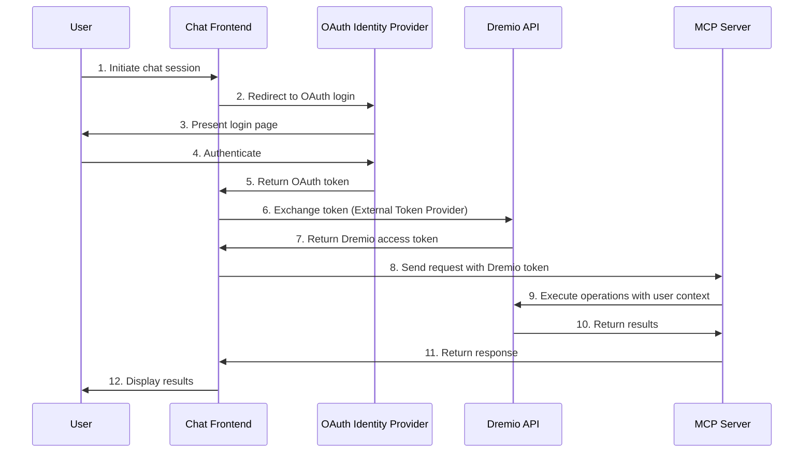

# Authentication Guide for Dremio MCP Server

## Overview

This guide explains how to implement secure authentication for the Dremio MCP Server in production environments using OAuth 2.0 and Dremio's External Token Provider.

## ⚠️ Important Security Notice

**DO NOT use Personal Access Tokens (PAT) in production deployments.** PATs should only be used for:
- Local development and testing
- CI/CD pipelines with service accounts
- Non-production environments

## Recommended Architecture: OAuth + External Token Provider

### Why This Approach?

- ✅ **User-scoped access**: Each user's Dremio permissions are enforced
- ✅ **No shared credentials**: Eliminates PAT sharing and rotation issues
- ✅ **Audit trail**: All operations are tracked to individual users
- ✅ **Token expiration**: Automatic session management and security
- ✅ **Centralized authentication**: Leverage existing IdP infrastructure
- ✅ **Compliance**: Meets enterprise security and compliance requirements

### Authentication Flow



## Implementation Guide

### Prerequisites

Before implementing this authentication flow, you need:

1. **OAuth 2.0 Identity Provider** configured (Azure AD, Okta, Google, etc.)
   - Refer to your IdP's documentation for setup

2. **Dremio External Token Provider** configured
   - Follow the [Dremio External Token Provider documentation](https://docs.dremio.com/current/security/authentication/application-authentication/external-token)
   - Contact Dremio support for Dremio Cloud configuration
   - Configure in `dremio.conf` for Dremio Software

### Step 1: Implement Token Exchange in Chat Frontend

Once your OAuth IdP and Dremio External Token Provider are configured, implement the token exchange in your chat frontend.

**Reference**: [Dremio OAuth Token API - Exchanging an External JWT](https://docs.dremio.com/current/reference/api/oauth-token/#exchanging-an-external-jwt)

#### JavaScript/TypeScript Example

```typescript
// auth.ts - OAuth and token exchange implementation

interface DremioTokenResponse {
  access_token: string;
  token_type: string;
  expires_in: number;
  issued_token_type: string;
  scope: string;
}

class DremioAuthService {
  private dremioBaseUrl: string;
  private dremioToken: string | null = null;
  private tokenExpiry: number = 0;

  constructor(dremioBaseUrl: string) {
    // e.g., "https://dremio.example.com" for Dremio Software
    this.dremioBaseUrl = dremioBaseUrl;
  }

  /**
   * Exchange OAuth JWT for Dremio access token
   * Uses Dremio's OAuth Token Exchange API
   *
   * Reference: https://docs.dremio.com/current/reference/api/oauth-token/#exchanging-an-external-jwt
   */
  async exchangeToken(oauthJwt: string): Promise<DremioTokenResponse> {
    const url = `${this.dremioBaseUrl}/oauth/token`;

    // Prepare form data as per Dremio API specification
    const formData = new URLSearchParams({
      subject_token: oauthJwt,
      subject_token_type: 'urn:ietf:params:oauth:token-type:jwt',
      grant_type: 'urn:ietf:params:oauth:grant-type:token-exchange',
      scope: 'dremio.all'
    });

    const response = await fetch(url, {
      method: 'POST',
      headers: {
        'Content-Type': 'application/x-www-form-urlencoded'
      },
      body: formData.toString()
    });

    if (!response.ok) {
      throw new Error(`Token exchange failed: ${response.status} ${response.statusText}`);
    }

    const tokenData: DremioTokenResponse = await response.json();

    // Store token and expiry
    this.dremioToken = tokenData.access_token;
    this.tokenExpiry = Date.now() + (tokenData.expires_in * 1000);

    return tokenData;
  }

  /**
   * Get valid Dremio token, refreshing if necessary
   */
  async getDremioToken(oauthJwt: string): Promise<string> {
    // Check if token is still valid (with 5 minute buffer)
    if (this.dremioToken && Date.now() < this.tokenExpiry - 300000) {
      return this.dremioToken;
    }

    // Exchange for new token
    const tokenData = await this.exchangeToken(oauthJwt);
    return tokenData.access_token;
  }
}

// Usage in chat application
async function initializeChatSession(oauthJwt: string) {
  const authService = new DremioAuthService(
    'https://dremio.example.com'  // Your Dremio Software instance
  );

  // Exchange OAuth JWT for Dremio token
  const dremioToken = await authService.exchangeToken(oauthJwt);

  // Store token securely (e.g., in session storage with encryption)
  sessionStorage.setItem('dremio_token', dremioToken.access_token);
  sessionStorage.setItem('dremio_token_expiry',
    String(Date.now() + dremioToken.expires_in * 1000));

  return dremioToken.access_token;
}
```

### Step 2: Use Dremio Token with MCP Server

Use the official Model Context Protocol SDK to communicate with the MCP server.

**Prerequisites:** Ensure `@modelcontextprotocol/sdk` is added as a dependency to your chat frontend application.

**TypeScript Example:**

```typescript
// mcp-client.ts - MCP server communication using official SDK
import { Client } from '@modelcontextprotocol/sdk/client/index.js';
import { SSEClientTransport } from '@modelcontextprotocol/sdk/client/sse.js';

class DremioMCPClient {
  private mcpServerUrl: string;
  private client: Client | null = null;

  constructor(mcpServerUrl: string) {
    // e.g., "https://dremio-mcp.example.com"
    this.mcpServerUrl = mcpServerUrl;
  }

  /**
   * Connect to MCP server with Dremio token
   */
  async connect(dremioToken: string): Promise<void> {
    // Create SSE transport with authentication
    const transport = new SSEClientTransport(
      new URL(this.mcpServerUrl),
      {
        headers: {
          'Authorization': `Bearer ${dremioToken}`
        }
      }
    );

    // Create and connect MCP client
    this.client = new Client({
      name: 'dremio-chat-client',
      version: '1.0.0'
    }, {
      capabilities: {}
    });

    await this.client.connect(transport);
  }

  /**
   * Execute SQL query via MCP
   */
  async executeQuery(sql: string): Promise<any> {
    if (!this.client) {
      throw new Error('MCP client not connected');
    }

    const result = await this.client.callTool({
      name: 'execute_sql',
      arguments: {
        sql: sql
      }
    });

    return result;
  }

  /**
   * List available tools
   */
  async listTools(): Promise<any> {
    if (!this.client) {
      throw new Error('MCP client not connected');
    }

    return await this.client.listTools();
  }

  /**
   * Close connection
   */
  async close(): Promise<void> {
    if (this.client) {
      await this.client.close();
      this.client = null;
    }
  }
}

// Usage example
async function runQuery(oauthJwt: string, sql: string) {
  // Step 1: Exchange OAuth JWT for Dremio token
  const authService = new DremioAuthService('https://dremio.example.com');
  const tokenResponse = await authService.exchangeToken(oauthJwt);

  // Step 2: Connect to MCP server with Dremio token
  const mcpClient = new DremioMCPClient('https://dremio-mcp.example.com');
  await mcpClient.connect(tokenResponse.access_token);

  try {
    // Step 3: Execute query
    const result = await mcpClient.executeQuery(sql);
    return result;
  } finally {
    // Step 4: Clean up
    await mcpClient.close();
  }
}
```

## Step 3: Deploy MCP Server

Deploy the MCP server using the Helm chart **without** PAT configuration:

```bash
# For Dremio Software
helm install dremio-mcp ./helm/dremio-mcp \
  --set dremio.uri=https://dremio.example.com:9047
```

See [examples/values-oauth-production.yaml](examples/values-oauth-production.yaml) for a complete production configuration.

## Security Best Practices

### 1. Token Storage

- ✅ Store tokens in secure, httpOnly cookies or encrypted session storage
- ✅ Never store tokens in localStorage (vulnerable to XSS)
- ✅ Implement token rotation and refresh logic
- ❌ Never log tokens or include them in error messages

### 2. HTTPS/TLS

- ✅ Always use HTTPS for all communications
- ✅ Enforce TLS 1.2 or higher
- ✅ Use valid SSL certificates (Let's Encrypt, etc.)
- ❌ Never allow HTTP in production

### 3. CORS Configuration

```yaml
# Ingress CORS configuration
nginx.ingress.kubernetes.io/enable-cors: "true"
nginx.ingress.kubernetes.io/cors-allow-origin: "https://chat.example.com"
nginx.ingress.kubernetes.io/cors-allow-methods: "GET, POST, OPTIONS"
nginx.ingress.kubernetes.io/cors-allow-headers: "Authorization, Content-Type"
nginx.ingress.kubernetes.io/cors-allow-credentials: "true"
```

### 4. Rate Limiting

```yaml
# Protect against abuse
nginx.ingress.kubernetes.io/limit-rps: "100"
nginx.ingress.kubernetes.io/limit-connections: "10"
```

## Troubleshooting

### Token Exchange Fails

1. Verify OAuth token is valid
2. Check Dremio External Token Provider configuration
3. Verify user exists in Dremio with correct permissions
4. Check network connectivity to Dremio API

### MCP Server Returns 401 Unauthorized

1. Verify Dremio token is included in Authorization header
2. Check token hasn't expired
3. Verify token format: `Bearer <token>`
4. Check MCP server logs for authentication errors

### User Permissions Issues

1. Verify user has appropriate Dremio permissions
2. Check Dremio role assignments
3. Verify OAuth claim mapping is correct
4. Review Dremio audit logs for access denials

## Additional Resources

- [Dremio OAuth Token API - Exchanging an External JWT](https://docs.dremio.com/current/reference/api/oauth-token/#exchanging-an-external-jwt)
- [Dremio External Token Provider Documentation](https://docs.dremio.com/current/security/authentication/application-authentication/external-token)
- [Model Context Protocol SDK](https://github.com/modelcontextprotocol/typescript-sdk)
- [OAuth 2.0 Token Exchange RFC 8693](https://datatracker.ietf.org/doc/html/rfc8693)
- [OWASP Authentication Cheat Sheet](https://cheatsheetseries.owasp.org/cheatsheets/Authentication_Cheat_Sheet.html)

