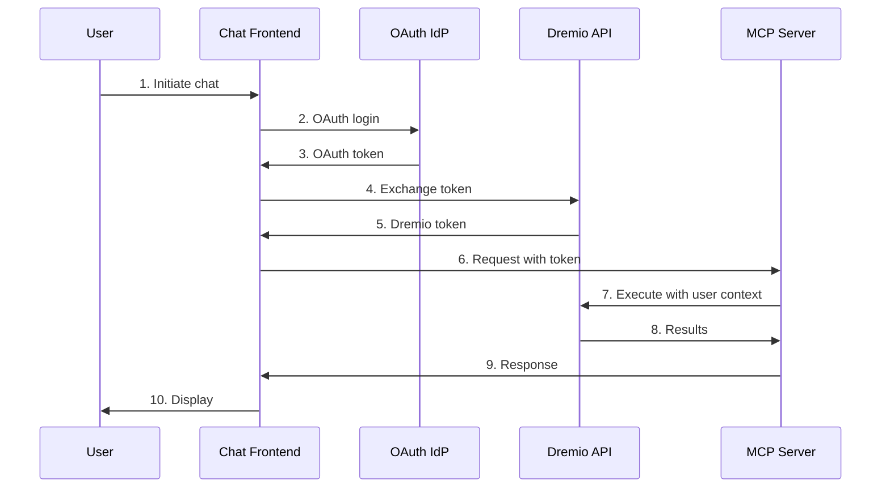

# Dremio MCP Helm Chart

This Helm chart deploys the Dremio MCP (Model Context Protocol) Server on a Kubernetes cluster using the Helm package manager.

## Quick Start

```bash
# 1. Build the Docker image
docker build -t dremio-mcp:0.1.0 .

# 2. Install with OAuth authentication (recommended)
helm install my-dremio-mcp ./helm/dremio-mcp \
  --set dremio.uri=https://dremio.example.com:9047
```

📖 **For production deployments, see [AUTHENTICATION.md](AUTHENTICATION.md) for OAuth setup.**

## Table of Contents

- [Quick Start](#quick-start)
- [Prerequisites](#prerequisites)
- [Authentication Architecture](#authentication-architecture)
- [Building the Docker Image](#building-the-docker-image)
- [Installing the Chart](#installing-the-chart)
- [Uninstalling the Chart](#uninstalling-the-chart)
- [Configuration](#configuration)
- [Examples](#examples)
- [Environment Variables](#environment-variables)
- [Troubleshooting](#troubleshooting)
- [Additional Resources](#additional-resources)

## Prerequisites

- Kubernetes 1.19+
- Helm 3.2.0+
- Docker image built from the Dockerfile in this repository
- **For Production**: OAuth 2.0 Identity Provider configured with Dremio External Token Provider

## Authentication Architecture

### OAuth + External Token Provider (Recommended)

Use OAuth with Dremio's External Token Provider for secure, user-scoped authentication.

📖 **See [AUTHENTICATION.md](AUTHENTICATION.md) for complete implementation guide with code examples.**

#### Quick Overview: Authentication Flow



**Key Steps:**
1. User authenticates with OAuth Identity Provider (Azure AD, Okta, Google, etc.)
2. Chat frontend receives OAuth token from IdP
3. Frontend exchanges OAuth token with Dremio using External Token Provider API
4. Dremio returns user-scoped access token
5. Frontend sends requests to MCP server with Dremio token
6. MCP server executes operations with user's permissions and context

For detailed implementation with code examples, see **[AUTHENTICATION.md](AUTHENTICATION.md)**.

#### Benefits of OAuth + External Token Provider

- ✅ **User-scoped access**: Each user's permissions are enforced
- ✅ **No shared credentials**: Secure token-based authentication
- ✅ **Audit trail**: All operations tracked to individual users
- ✅ **Token expiration**: Automatic session management
- ✅ **Centralized auth**: Leverage existing IdP infrastructure
- ✅ **Compliance**: Meets enterprise security requirements

---

## Building the Docker Image

Before deploying the Helm chart, build the Docker image:

```bash
docker build -t dremio-mcp:0.1.0 .
```

If using a private registry, tag and push the image:

```bash
docker tag dremio-mcp:0.1.0 <your-registry>/dremio-mcp:0.1.0
docker push <your-registry>/dremio-mcp:0.1.0
```

## Installing the Chart

### Production Installation (OAuth + External Token Provider) - Recommended

For production deployments, configure your chat frontend to handle OAuth authentication and token exchange.

See the complete example: [examples/values-oauth-production.yaml](examples/values-oauth-production.yaml)

```bash
# Install with OAuth-based configuration
helm install my-dremio-mcp ./helm/dremio-mcp \
  --set dremio.uri=https://dremio.example.com:9047
```

Or create a `production-values.yaml` file:

```yaml
dremio:
  uri: "https://dremio.example.com:9047"
  # Authentication handled by chat frontend via OAuth

mcp:
  enableStreamingHttp: true
  port: 8000
  logging:
    enableJson: true
    level: "INFO"

resources:
  limits:
    cpu: 1000m
    memory: 1Gi
  requests:
    cpu: 500m
    memory: 512Mi

ingress:
  enabled: true
  className: nginx
  hosts:
    - host: dremio-mcp.example.com
      paths:
        - path: /
          pathType: Prefix
```

Then install:

```bash
helm install my-dremio-mcp ./helm/dremio-mcp -f production-values.yaml
```


## Uninstalling the Chart

To uninstall/delete the `my-dremio-mcp` deployment:

```bash
helm uninstall my-dremio-mcp
```

## Configuration

The following table lists the configurable parameters of the Dremio MCP chart and their default values.

For complete examples, see the [examples/](examples/) directory.

### Dremio Configuration

| Parameter | Description | Default |
|-----------|-------------|---------|
| `dremio.uri` | Dremio Software instance URI (required) | `""` |
| `dremio.allowDml` | Allow DML operations (create views, etc.) | `false` |

**Note**: Authentication is handled by the chat frontend via OAuth + External Token Provider. See [AUTHENTICATION.md](AUTHENTICATION.md).

### MCP Server Configuration

| Parameter | Description | Default |
|-----------|-------------|---------|
| `mcp.enableStreamingHttp` | Enable streaming HTTP mode | `true` |
| `mcp.port` | Port for the MCP server | `8000` |
| `mcp.host` | Host binding | `"0.0.0.0"` |
| `mcp.logging.enableJson` | Enable JSON logging | `false` |
| `mcp.logging.level` | Log level (DEBUG, INFO, WARNING, ERROR, CRITICAL) | `"INFO"` |
| `mcp.logging.toFile` | **IGNORED** - Always false in containers (logs to stdout/stderr) | `false` |

### Tools Configuration

| Parameter | Description | Default |
|-----------|-------------|---------|
| `tools.serverMode` | Server mode (comma-separated) | `"FOR_SELF,FOR_DATA_PATTERNS"` |

Available modes:
- `FOR_SELF` - Basic tools for self-service
- `FOR_DATA_PATTERNS` - Tools for data pattern analysis
- `FOR_SEARCH` - Search-related tools
- `FOR_ADMIN` - Administrative tools

### Metrics Configuration

| Parameter | Description | Default |
|-----------|-------------|---------|
| `metrics.enabled` | Enable Prometheus metrics | `false` |
| `metrics.port` | Metrics port | `9091` |

### Image Configuration

| Parameter | Description | Default |
|-----------|-------------|---------|
| `image.repository` | Image repository | `dremio-mcp` |
| `image.pullPolicy` | Image pull policy | `IfNotPresent` |
| `image.tag` | Image tag | `""` (uses chart appVersion) |

### Service Configuration

| Parameter | Description | Default |
|-----------|-------------|---------|
| `service.type` | Kubernetes service type | `ClusterIP` |
| `service.port` | Service port | `8000` |

### Ingress Configuration

| Parameter | Description | Default |
|-----------|-------------|---------|
| `ingress.enabled` | Enable ingress | `false` |
| `ingress.className` | Ingress class name | `""` |
| `ingress.hosts` | Ingress hosts configuration | See values.yaml |

### Resource Configuration

| Parameter | Description | Default |
|-----------|-------------|---------|
| `resources.limits.cpu` | CPU limit | Not set |
| `resources.limits.memory` | Memory limit | Not set |
| `resources.requests.cpu` | CPU request | Not set |
| `resources.requests.memory` | Memory request | Not set |

## Examples

All example configurations are available in the [examples/](examples/) directory:

- **[values-oauth-production.yaml](examples/values-oauth-production.yaml)** - Production deployment with OAuth (recommended)
- **[values-onprem.yaml](examples/values-onprem.yaml)** - Dremio Software deployment

### Production Deployment with OAuth (Recommended)

This example shows a production-ready deployment using OAuth + External Token Provider authentication.

**Full example**: [examples/values-oauth-production.yaml](examples/values-oauth-production.yaml)

```yaml
# Production deployment with OAuth authentication
# Authentication handled by chat frontend via OAuth + External Token Provider
dremio:
  uri: "https://dremio.example.com:9047"

image:
  repository: myregistry.io/dremio-mcp
  tag: "0.1.0"

mcp:
  enableStreamingHttp: true
  port: 8000
  logging:
    enableJson: true
    level: "INFO"

resources:
  limits:
    cpu: 1000m
    memory: 1Gi
  requests:
    cpu: 500m
    memory: 512Mi

service:
  type: ClusterIP
  port: 8000

ingress:
  enabled: true
  className: nginx
  annotations:
    cert-manager.io/cluster-issuer: "letsencrypt-prod"
    nginx.ingress.kubernetes.io/ssl-redirect: "true"
    # CORS configuration for chat frontend
    nginx.ingress.kubernetes.io/enable-cors: "true"
    nginx.ingress.kubernetes.io/cors-allow-origin: "https://chat.example.com"
    nginx.ingress.kubernetes.io/cors-allow-methods: "GET, POST, OPTIONS"
    nginx.ingress.kubernetes.io/cors-allow-headers: "Authorization, Content-Type"
  hosts:
    - host: dremio-mcp.example.com
      paths:
        - path: /
          pathType: Prefix
  tls:
    - secretName: dremio-mcp-tls
      hosts:
        - dremio-mcp.example.com

autoscaling:
  enabled: true
  minReplicas: 2
  maxReplicas: 10
  targetCPUUtilizationPercentage: 80

# Security best practices
podSecurityContext:
  runAsNonRoot: true
  runAsUser: 1001
  fsGroup: 1001

securityContext:
  allowPrivilegeEscalation: false
  capabilities:
    drop:
    - ALL
  readOnlyRootFilesystem: true
```

### On-Premise Dremio Deployment

**Full example**: [examples/values-onprem.yaml](examples/values-onprem.yaml)

```yaml
dremio:
  uri: "https://dremio.mycompany.com:9047"

mcp:
  enableStreamingHttp: true
  logging:
    level: "DEBUG"

tools:
  serverMode: "FOR_SELF,FOR_DATA_PATTERNS,FOR_ADMIN"

resources:
  limits:
    cpu: 500m
    memory: 512Mi
```

## Environment Variables

The chart automatically configures the following environment variables based on the values:

| Environment Variable | Source | Description |
|---------------------|--------|-------------|
| `DREMIOAI_DREMIO__URI` | `dremio.uri` | Dremio Software instance URI |
| `DREMIOAI_DREMIO__ALLOW_DML` | `dremio.allowDml` | Allow DML operations |
| `DREMIOAI_TOOLS__SERVER_MODE` | `tools.serverMode` | Server mode configuration |
| `DREMIOAI_DREMIO__METRICS__ENABLED` | `metrics.enabled` | Enable Prometheus metrics |
| `DREMIOAI_DREMIO__METRICS__PORT` | `metrics.port` | Metrics port |

**Note**: The environment variable prefix `DREMIOAI_` and nested delimiter `__` (double underscore) are defined in `src/dremioai/config/settings.py`.

## Troubleshooting

### Check Pod Status

```bash
kubectl get pods -l app.kubernetes.io/name=dremio-mcp
```

### View Logs

```bash
# Follow logs
kubectl logs -f deployment/my-dremio-mcp

# View logs with JSON parsing (if JSON logging enabled)
kubectl logs deployment/my-dremio-mcp | jq .
```

### Test Connection

```bash
# Port forward to local machine
kubectl port-forward svc/my-dremio-mcp 8000:8000

# Test health endpoint
curl http://localhost:8000/health

# Test with authentication
curl -H "Authorization: Bearer <dremio-token>" \
  http://localhost:8000/mcp
```

### Common Issues

#### 1. Pod Not Starting

Check if the Docker image is accessible:
```bash
kubectl describe pod <pod-name>
kubectl get events --sort-by='.lastTimestamp'
```

Common causes:
- Image pull errors (check `imagePullSecrets`)
- Resource constraints (check node resources)
- Security context issues

#### 2. Authentication Errors

For OAuth authentication:
- Verify token exchange is working in chat frontend
- Check Dremio External Token Provider configuration
- Review MCP server logs for authentication errors
- Verify the Authorization header is being sent correctly

```bash
# Check environment variables in pod
kubectl exec -it <pod-name> -- env | grep DREMIOAI
```

#### 3. Connection to Dremio Fails

Verify URI and network connectivity:
```bash
# Test from pod
kubectl exec -it <pod-name> -- curl -v <dremio-uri>

# Check DNS resolution
kubectl exec -it <pod-name> -- nslookup dremio.example.com

# Test with authentication
kubectl exec -it <pod-name> -- curl -H "Authorization: Bearer <token>" \
  <dremio-uri>/api/v3/catalog
```

#### 4. Performance Issues

Check resource usage:
```bash
# Pod resource usage
kubectl top pod -l app.kubernetes.io/name=dremio-mcp

# Check HPA status (if enabled)
kubectl get hpa

# View detailed metrics (if metrics enabled)
kubectl port-forward svc/my-dremio-mcp 9091:9091
curl http://localhost:9091/metrics
```

#### 5. Ingress/CORS Issues

For production deployments with ingress:
```bash
# Check ingress status
kubectl get ingress
kubectl describe ingress my-dremio-mcp

# Test CORS headers
curl -H "Origin: https://chat.example.com" \
  -H "Access-Control-Request-Method: POST" \
  -H "Access-Control-Request-Headers: Authorization" \
  -X OPTIONS \
  https://dremio-mcp.example.com/mcp -v
```

### Getting Help

- Review [AUTHENTICATION.md](AUTHENTICATION.md) for authentication setup
- Check [examples/](examples/) for configuration examples
- Review Dremio MCP server logs for detailed error messages
- Consult [Dremio documentation](https://docs.dremio.com/) for Dremio-specific issues

## Additional Resources

- [Dremio External Token Provider Documentation](https://docs.dremio.com/current/security/authentication/application-authentication/external-token)
- [Model Context Protocol Specification](https://modelcontextprotocol.io/)
- [Kubernetes Documentation](https://kubernetes.io/docs/)
- [Helm Documentation](https://helm.sh/docs/)

## License

Apache License 2.0

